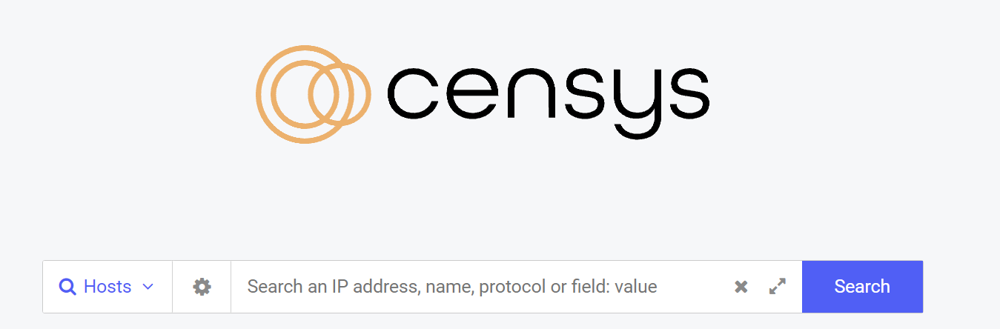
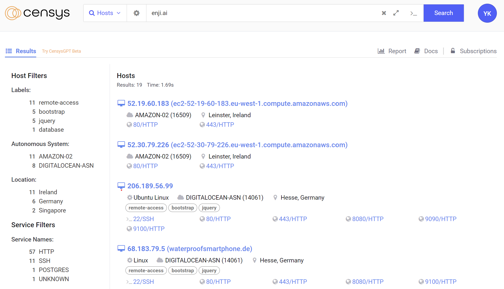
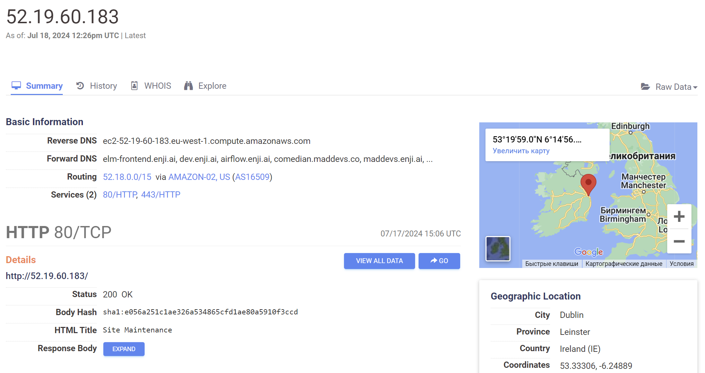

# Writeup: Finding a Server's Origin IP

# Summary

One of the initial challenges encountered during a penetration testing engagement is identifying the origin IP address of the target server. This write-up will show various methods and strategies to effectively determine the server's origin IP address.

# What does "origin IP" mean?

Many services today utilize various Content Delivery Network (CDN) providers, such as CloudFlare, Akamai, and Amazon CloudFront. These providers are designed to protect and support web servers by acting as reverse proxies, handling all incoming traffic.

This achieves several important objectives, including:

- **DDoS Protection:** CDNs offer protection against Distributed Denial of Service (DDoS) attacks by absorbing and mitigating the impact of malicious traffic.

- **Load Balancing:** CDNs distribute incoming traffic across multiple servers, preventing any single server from becoming overloaded and ensuring high availability and reliability.

- **Content Caching:** CDNs store copies of static content (such as images, CSS, and JavaScript files) on servers closer to users, thereby reducing latency and load times.

When you make an HTTP request to a domain, you are actually making a request to the CDN provider that the domain is using. This means you cannot retrieve the real server IP address.

# Why is this important?

Understanding the server's origin IP is crucial for accurately assessing vulnerabilities and potential security risks. This knowledge enables both threat actors and penetration testers to:

- Precisely map the network infrastructure and identify services operating on various IP addresses.
- Make direct HTTP requests that bypass CDN filtering mechanisms, potentially exposing multiple attack vectors.

# Techniques and Methods

Let's explore some popular techniques to retrieve the real IP address of `enji.ai` domain. There are various methods available to potentially retrieve the real IP address. The application may inadvertently leak its server IP through various channels: exposed services on specific ports, custom HTTP headers, outdated DNS records, and numerous other avenues.

First, we can use the `host` and `whois` utilities to gather more information about the domain in question:

```
@deadsec ➜ ~  host enji.ai
enji.ai has address 172.66.XX.XX
enji.ai has address 162.159.XX.XX
```

```
@deadsec ➜ ~  whois 172.66.XX.XX
...
NetRange:       172.64.0.0 - 172.71.255.255
NetName:        CLOUDFLARENET
OrgName:        Cloudflare, Inc.
...
```

From the information above, we can see that this IP address is owned by Cloudflare. This indicates that all our requests are routed through the CDN.

## SSL-ceritifcates

SSL certificates provide another valuable avenue for discovering a server's origin IP address. When a server hosts an SSL certificate, various details about the certificate, including its public key, can be used to trace back to the original server, even when the server is behind a CDN. Tools like Censys and CRT.sh can help a lot with certificate analysys.

We will use Censys to verify the certificate associated with a domain.
At `https://search.censys.io/` we are presented with a clean and concise interface:


After entering our domain, we receive numerous responses:


Let's examine the first IP address in the results:

This provides us with a wealth of valuable information. In the `Forward DNS` and `Names` sections, we see the associated domains and names, respectively. This helps us identify the owner of the IP address. As we can see, this IP address belongs to our target:

```
Forward DNS: elm-frontend.enji.ai, dev.enji.ai, airflow.enji.ai ...
```

```
Names: *.comedian.maddevs.co, *.dev.enji.ai, *.enji.ai, *.staging.enji.ai, comedian.maddevs.co, enji.ai
```

By accessing using `curl -v http://52.19.60.183/ -H 'Host: enji.ai'`, we observe that we have found the correct IP address:

```
HTTP/1.1 301 Moved Permanently
Content-Type: text/html
Location: https://enji.ai:443/

<html>
<head><title>301 Moved Permanently</title></head>
<body>
<center><h1>301 Moved Permanently</h1></center>
```

This method is one of the simplest and most efficient ways to identify the real IP address of a target. Keep in mind that the different IP addresses identified during our investigation won't necessarily be the host IPs for `enji.ai`, but they provide valuable clues about the present subnet and expanding our attack surface.

## Subdomains

Occasionally, some subdomains are not routed through the CDN and might expose the real IP address. This often includes mail servers, FTP servers, and other similar services. We can use Subfinder to identify different subdomains associated with `enji.ai` as follows:

```
$ subfinder -d enji.ai
[INF] Enumerating subdomains for enji.ai
...
docs.enji.ai
...
```

As shown, there is a documentation endpoint `docs.enji.ai`, which might not be routed through the CDN. Let's investigate this further.
We will use the host command to check if the CDN is present:

```
$ host enji.ai
enji.ai has address 172.66.0.96
enji.ai has address 162.159.140.98
```

Next, we will use host on the `docs.enji.ai` subdomain to verify our hypothesis:

```
$ host docs.enji.ai
docs.enji.ai has address 52.30.219.62
```

From the output above, we can see that `docs.enji.ai` is not routed through a CDN, which reveals the `docs.enji.ai` real IP address.

## DNS Records Analysis

By examining the DNS records of a domain, an attacker could potentially discover previously exposed IP addresses of the server from times when it was not behind a CDN. DNS records provide various types of information about a domain, and by analyzing these records, penetration testers can gather valuable insights that may lead to the discovery of the origin IP.

### Types of DNS Records

Different types of DNS records can reveal specific details about the domain and its infrastructure:

- **A Records:** These records map a domain name to an IPv4 address. By examining historical A records, one can find previous IP addresses that may have been used by the domain before switching to a CDN.

- **AAAA Records:** Similar to A records but for IPv6 addresses. Historical AAAA records can also provide information on previous IPv6 addresses.

- **MX Records:** Mail Exchange records specify the mail servers responsible for receiving email on behalf of the domain. Sometimes, these mail servers are not routed through the CDN, revealing the real IP address.

- **TXT Records:** Text records can contain various forms of information, including verification details for email services and other metadata. Occasionally, these records might inadvertently expose internal IP addresses or other sensitive information.

- **CNAME Records:** Canonical Name records alias one domain to another. By following the chain of CNAME records, it’s possible to uncover the origin domain that might point directly to the real server IP.

We can use the `dig` command to find the real IP address through DNS records. By querying the DNS records of a domain, `dig` provides detailed information about the IP addresses associated with the domain. Running `dig` on `enji.ai` outputs the following:

```
...
enji.ai.                0       IN      A       162.159.140.98
enji.ai.                0       IN      A       172.66.0.96
...
```

This output shows that the `enji.ai` resolves to two IP addresses, `162.159.140.98` and `172.66.0.96`, both of which are associated with Cloudflare.
However, when we run `dig` on subdomains like `dev.enji.ai` or `auth.enji.ai`, the results are different:

```
...
a33...075.eu-west-1.elb.amazonaws.com. 0 IN A 52.19.60.183
a33...075.eu-west-1.elb.amazonaws.com. 0 IN A 52.30.79.226
...
```

We can see that the subdomains `dev.enji.ai` and `auth.enji.ai` resolve to the CNAME record `a33...075.eu-west-1.elb.amazonaws.com`, which in turn resolves to the IP addresses `52.19.60.183` (which is our real IP adress) and `52.30.79.226`. By identifying such records, we can often bypass the CDN and uncover the real IP addresses of the servers hosting these subdomains.

## CDN IP ranges

Given that Enji.AI is hosted on AWS, we can utilize CN/SANs of all Amazon's IPs to identify the IP address associated with our domain. This can be accomplished with the following command:

> **How do i find IP ranges of different providers?** This particular `amazon-ipv4-sni.txt` dictionary was found on `kaeferjaeger.gay/sni-ip-ranges/amazon`. You can easily find one on the internet.

```
$ cat amazon-ipv4-sni.txt | grep enji.ai
...
52.209.176.32:443 -- [enji.ai *.comedian.maddevs.co *.staging.enji.ai *.enji.ai *.dev.enji.ai comedian.maddevs.co]
...
```

In this instance, the identified IP address is now associated with a different domain, rendering it irrelevant for our current needs. However, this method remains highly valuable for uncovering the actual IP address of different domains in future engagements.

## Additional Methods

Here are some additional techniques that can assist in uncovering the real IP address of the server:

- **Host Header Fuzzing:** Even such things as `Host` header fuzzing using various subdomains and loopback IPs can occasionally bypass a CDN, enabling direct HTTP requests.
- **WordPress Pingback:** In the case of WordPress, there is an interesting technique called `pingback` that sometimes allows an attacker to retrieve the real IP address of the server. For a detailed explanation, you can refer to this [excellent article](https://blog.nem.ec/2020/01/22/discover-cloudflare-wordpress-ip/).
- **Social Engineering** Threat actors could use diverse social engineering techniques to uncover real IP addresses. Methods such as phishing, pretexting, and even physical reconnaissance (like dumpster diving) can potentially yield that missing piece of valuable information such as IP adress.

# Useful tools

## CloudFlair

We can use [CloudFlair](https://github.com/christophetd/CloudFlair) to find the origin IP of the `enji.ai` domain. This tool is very useful and it also uses Censys API to query different certificates, related to a specific domain. We can start it by running the following command:

```
$ python cloudflair.py enji.ai
[*] Retrieving Cloudflare IP ranges from https://www.cloudflare.com/ips-v4
[*] The target appears to be behind CloudFlare.
[*] Looking for certificates matching "enji.ai" using Censys
[*] 72 certificates matching "enji.ai" found.
[*] Splitting the list of certificates into chunks of 25.
[*] Looking for IPv4 hosts presenting these certificates...
[*] 3 IPv4 hosts presenting a certificate issued to "enji.ai" were found.
  - 34.252.154.19
  - 34.247.206.200
  - 63.32.27.129
[*] Testing candidate origin servers
[*] Retrieving target homepage at https://enji.ai
[*] "https://enji.ai" redirected to "https://enji.ai/"
  - 34.252.154.19
      responded with an unexpected HTTP status code 404
  - 34.247.206.200
  - 63.32.27.129
[-] Did not find any origin server.
```

We can send a `GET` request to one of the found IP's and get this:

```
$ curl -v https://34.247.206.200 -k
...
<p>
    We are performing quick maintenance at the moment and will be baonline soon.
    Try to refresh the page or come back in a few minutes.
</p>
<p>&mdash; The Enji.ai Team</p>
...
```

Looking at the output, the tool stated that it didn't found an origin IP, but we found many other IP's that could be useful in our engagement.

## Other tools

Two of the most effective and widely-used tools for discovering IP addresses are Censys and Shodan. These powerful platforms comprehensively scan domains, gathering a wide array of data including HTTP headers, SSL certificates, services operating on various ports, and metadata analysis. By leveraging the extensive databases and sophisticated search capabilities of Censys and Shodan, we can uncover critical information about a target's infrastructure, identify potential vulnerabilities, and gain insights into the configuration and exposure of network services.

There are numerous command-line interface (CLI) utilities that can be invaluable for discovering the real IP address of a server:

- `host` command can quickly resolve a domain name to its corresponding IP address.
- `whois` provides detailed registration information about domain ownership and associated IP ranges.
- `dig` and `nslookup` are essential for querying DNS records, offering detailed insights into domain name resolutions and configurations.
- `curl` allows for testing and interacting with URLs, providing the ability to see how a server responds to various requests.

These utilities, when used together, can paint a comprehensive picture of the target's network setup.

When examining DNS records, there are various tools available that can assist:

- **SecurityTrails** offers a comprehensive platform for accessing historical DNS data, domain and IP lookups, and extensive API capabilities, allowing for detailed and in-depth analysis.
- **DNSDumpster** is a valuable resource for DNS reconnaissance, enabling users to identify all subdomains and associated IP addresses of a target domain. It provides a clear picture of the domain's DNS configuration and potential vulnerabilities.
- **VirusTotal**, while primarily known for its malware analysis capabilities, also includes features for examining DNS records and related domain information. By submitting a domain to VirusTotal, users can gain insights into its DNS history, associated IP addresses, and any potential security threats linked to the domain.

# Ethical and Legal Considerations

It's essential to understand the ethical and legal implications of these techniques. Penetration testers must always have proper authorization before conducting any form of testing. Unauthorized access, enumerating or scanning can lead to legal consequences and damage to reputation.

# Conclusion

Identifying a server's origin IP is a critical step in understanding the underlying infrastructure and potential vulnerabilities of a target. While CDNs provide robust security and performance benefits, they also introduce challenges in directly accessing the server's IP. Through a combination of technical methods and tools, as well as social engineering tactics, penetration testers and threat actors alike can uncover this crucial information. It is essential to stay informed about these techniques to better protect and secure network environments against potential threats.